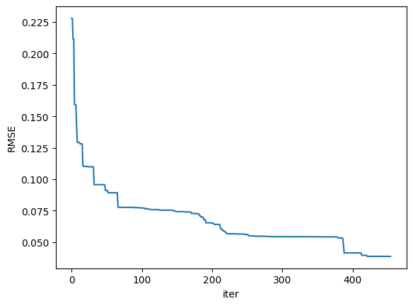
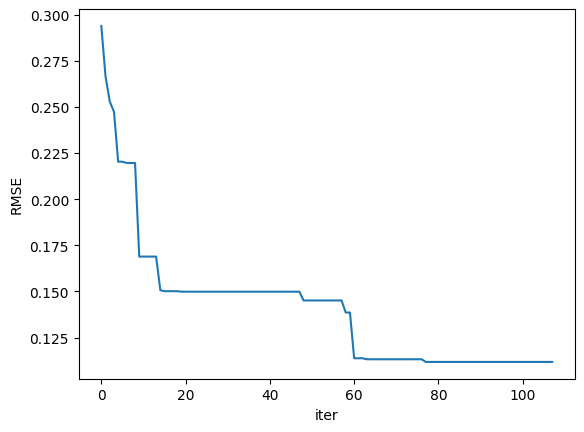
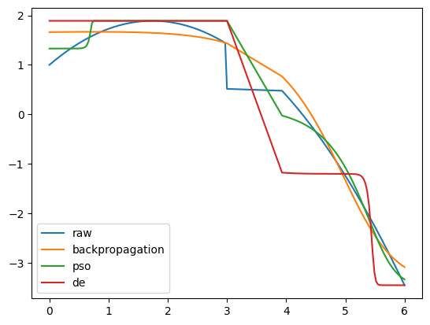
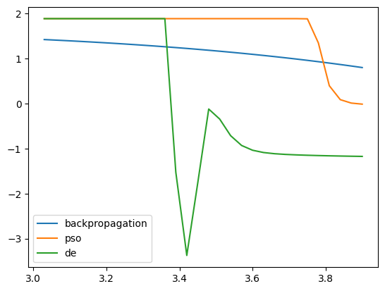

# Tarefa Computacional 1
Trabalho computacional sobre treinamento de redes neurais usando algoritmos evolutivos
aplicado para problemas de aproximação de curvas para dados fornecidos.

> Leandro Furlam Turi


## 1. Implementação
### 1.1. Aspectos gerais
A implementação deu-se utilizando a plataforma Jupyter Notebook. Sugere-se para execução utilizar o ambiente online [Google Colab](https://colab.research.google.com/). Os resultados obtidos foram serializados (pasta _data/_) utilizando o pacote *pickle*, podendo ser utilizados posteriormente.

A base de dados original recebeu os tratamentos (1) normalização z-score para as bases de entrada X e (2) min-max para as saídas Y, mapeando-a ao intervalo [0, 1].


### 1.2. Rede neural
A rede neural utilizada neste trabalho foi implementada utilizando pacotes padrão da linguagem Python, baseando-se no trabalho de Jason Brownlee: [How to Code a Neural Network with Backpropagation In Python (from scratch)](https://machinelearningmastery.com/implement-backpropagation-algorithm-scratch-python/). 

Constitui-se de uma função de transferência, função de ativação sigmóide, a propagação forward das entradas às saídas da rede, e um método de predição.

Ressalta-se a arquitetura da rede: para a camada oculta, são definidos `n_hidden` neurônios e cada um tem `n_inputs + 1` pesos, um para cada coluna de entrada e um adicional para o viés. A camada de saída que se conecta à camada oculta possui `n_outputs` neurônios, cada um com `n_hidden + 1` pesos, ou seja, cada neurônio na camada de saída se conecta a cada neurônio na camada oculta. Disto, teremos `(n_inputs + 1)*n_hidden + (n_hidden + 1)*n_outputs` parâmetros.

Um exemplo de uma rede com `n_inputs=2`, `n_hidden=1` e `n_outputs=2` é apresentada a seguir:

```{py}
[{'weights': [0.134, 0.847, 0.763]}] # hidden_layer
[{'weights': [0.255, 0.495]}, {'weights': [0.449, 0.651]}] # output_layer
```

Para produzir este relatório foram utilizadas `n_hidden = 10` camadas ocultas, e `n_inputs = n_outputs = 1`.


### 1.3. Algoritmos Evolutivos
Utilizou-se as heurísticas do pacote [pymoo](https://pymoo.org/). A iteroperabilidade entre a implementação da rede neural e os métodos do pacote *pymoo* deu-se através da definição via herança de um objeto `ElementwiseProblem`, que implementa uma função avaliando uma única solução por vez. Aqui, o indivíduo de tamanho `n_var = (n_inputs + 1)*n_hidden + (n_hidden + 1)*n_outputs`, representado por uma lista, é mapeado diretamente à estrutura da rede proposta, fazendo com que seja possível utilizar a implementação definida.

Acerca da função fitness, utilizou-se a Root of the Mean Squared Error (RMSE).

Sobre os hiperparêmetros do modelo, apenas definimos o tamanho populacional de 50 indivíduos para ambos os algoritmos e inertia de 0.9, cognitive impact de 2.0 e social impact de 2.0 para o PSO. Os demais operadores foram utilizados o padrão da implementação. Destaca-se os operadores do DE: seleção via torneio, Simulated Binary Crossover (SBX) e Polynomial Mutation (PM), todos padrão do pacote.

Limitou-se todos os parâmetros da rede neural no intervalo [-100, 100].


## 2. Resultados obtidos
Os resultados obtidos são apresentados na Tabela a seguir:
método | RMSE | iter | time
--- | --- | --- | ---
backpropagation | 0.285592 | 1000 | 8.19 s
PSO | 0.038734 | 455 | 1min 10s
DE | 0.111832 | 108 | 17.4 s


Enquanto o decaimento da função objetivo dos métodos PSO e DE podem ser observados, respectivamente, nas Figuras a seguir.






Nota-se que o PSO foi o método onde houve maior minimização da função objetivo, embora este tenha apresentado maior quantidade de iterações. Acerca do tempo computacional, ambos os métodos computaram em tempo viável.

A Figura a seguir apresenta uma comparação entre as soluções obtidas por cada método, bem como a base de dados original. Observa-se que apenas em ambos os métodos heurísticos houve tentativa de representar o área de maior dificuldade (o "dente") do conjunto de dados, causando efeitos negativos nas redondezas dese ponto.



A título de curiosidade, os resultados obtidos com a base de teste são apresentados na Figura a seguir.




## 3. Conclusão
Embora o método clássico de backpropagation tenha apresentado soluções satisfatórias, os métodos heurísticos, sobretudo o método PSO, convergiram em boas soluções, adaptando-se melhor à irregularidades presentes nas bases de dados, com um tempo computacional viável.
