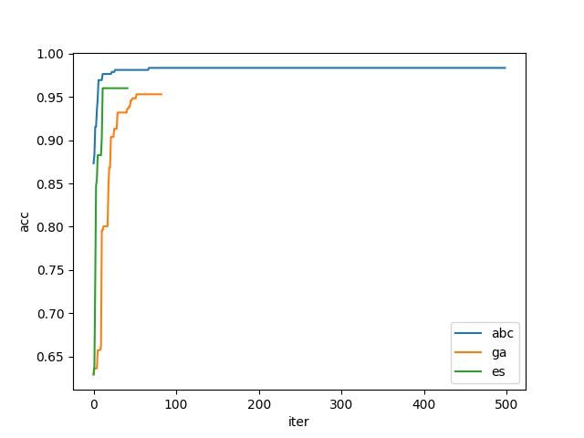

# Tarefa Computacional 2
Projeto, implementação do algoritmo Artificial Bee Colony (ABC) para clusterização de dados

> Leandro Furlam Turi


## 1. Implementação
### 1.1. Aspectos gerais
Toda a implementação da metaheurística foi realizada utilizando apenas pacotes-padrão da linguagem Python, bem como o pacote *Numpy*. As bases de dados e a divisão da base de treino e teste foram realizadas através do pacote *Sckit-learn*.

### 1.2. Bases de dados
Foram utilizadas as bases de dados *Breast Cancer* e *Wine* disponíveis pelo *Sckit-learn* e *Diabetes* disponível de [*Datahub*](https://datahub.io/machine-learning/diabetes). 
A base de dados original recebeu os tratamentos normalização z-score para as bases de entrada.

### 1.3. Algoritmo Evolutivo: Artificial Bee Colony
A implementação realizada baseou-se nos trabalhos de [Shams K. Nseef et. al. [2016]](https://www.sciencedirect.com/science/article/abs/pii/S0950705116300363).

O algoritmo foi proposto por [Karaboga, 2008](https://abc.erciyes.edu.tr/pub/tr06_2005.pdf) como um algoritmo de inteligência de enxame inspirado na natureza baseado na observação do comportamento de forrageamento das abelhas. No ABC, há um conjunto de fontes de alimento e um conjunto de abelhas. A qualidade das fontes de alimento é baseada na quantidade de néctar que elas contêm. As abelhas procuram e colaboram umas com as outras, buscando melhores fontes de alimento.  
Para resolver um problema de otimização usando o ABC, as fontes de alimento representam a população de soluções para um determinado problema e as abelhas são categorizadas em três tipos: *batedoras*, *funcionárias* e *observadoras*. A quantidade de néctar corresponde à qualidade (função objetivo) do problema que está sendo tratado. Os três tipos de abelhas trabalham juntos de forma iterativa para melhorar a qualidade da população de soluções (fontes de alimento). O pseudo-código de um ABC básico é mostrado a seguir. O ABC primeiro define os parâmetros principais, inicializa a população de soluções e depois as avalia. Em seguida, o loop principal é executado na tentativa de resolver o problema de otimização dado chamando as abelhas funcionárias, abelhas observadoras e abelhas batedoras até que a condição de parada seja satisfeita.

Algoritmo: Pseudo-código do ABC
```
Passo 1: Inicializar parâmetros
Passo 2: Inicializar a população de soluções
Passo 3: Avaliar a população de soluções
enquanto a condição de término não for atendida faça
    Passo 4: Etapa das abelhas funcionárias
    Passo 5: Etapa das abelhas observadoras
    Passo 6: Etapa das abelhas batedoras
fim-enquanto
```

* Passo 1: Nesta etapa são inicializados os principais parâmetros do ABC. Estes incluem: o número máximo de iterações (`max_it`) que representa a condição de parada do ABC, o número de soluções ou tamanho da população (`PS`) que representa quantas soluções serão geradas, o número total de abelhas (Sbees) que é definido como o dobro do tamanho de Ps, onde metade delas são abelhas empregadas e a outra metade são abelhas observadoras, o parâmetro limite (`Lit`), que é usado para determinar se a solução deve ser substituída por uma nova.


* Passo 2: Um conjunto de soluções com tamanho igual a `PS` é gerado aleatoriamente da seguinte forma:

`x_i = x_min + rand[0,1](x_max - x_min)`

onde `x_max` e `x_min` são os limites máximo e mínimo da variável de decisão `x`.


* Passo 3: Cálculo da aptidão das soluções. É importante ter este passo, visto que uma solução pode ser avaliada diversas vezes em uma mesma iteração.


* Passo 4: Etapa das abelhas funcionárias. Cada abelha funcionária é enviada para uma fonte de alimento (solução). Sua principal função é explorar a vizinhança da solução atual, buscando uma solução melhorável. Uma solução de vizinhança, `v`, é criada modificando a `i`-ésima solução, `x`, como segue:

`v_i = x_i + rand[-1,1](x_i - x_k)`

onde `x_k` é gerado aleatoriamente na população. A solução de vizinhança gerada será substituída pela solução atual se tiver melhor aptidão.


* Passo 5: Etapa das abelhas observadoras. As abelhas observadoras procuram melhorar a população atual de soluções explorando sua vizinhança usando a mesma que a abelha funcionária. A diferença é que as abelhas observadoras selecionam as soluções probabilisticamente com base em seus valores de aptidão da seguinte forma:

`p_i = fitness / sum_j=1:PS(fitness_j)`

Ou seja, a solução com maior aptidão tem maior chance de ser selecionada (ou seja, seleção da roleta). As abelhas observadoras utilizam um mecanismo de seleção guloso, onde a melhor solução em termos de aptidão é selecionada.


* Passo 6: Etapa das abelhas batedoras
Esta etapa é ativada se as abelhas funcionárias e observadoras não puderem melhorar a solução atual por um número de iterações consecutivas definido pelo parâmetro limite, `Lit`. Isso indica que a solução atual não é boa o suficiente para pesquisar sua vizinhança e deve ser descartada. Nesse caso, a abelha exploradora gerará uma nova solução usando a Equação descrita no Passo 2 para substituir a descartada. Isso pode ajudar o ABC a escapar de um ótimo local e explorar uma área diferente do espaço de busca.


### 1.4. Modelagem do problema
#### 1.4.5. Parâmetros
- PS = 50  
- Lit = 30  
- max_it = 500  

#### 1.4.2. Indivíduo (abelha)
Cada abelha representa `K` centróides em `R^n_var`, onde `K` é o número de clusters e `n_var` é a dimensão do espaço de variáveis de entrada. Para simplificar os cômputos, todos os pontos foram rearranjados em um único vetor `v = {a_1, a_2, a_3, ..., a_n_var, b_1, b_2, b_3, ..., b_n_var, ..., k_1, k_2, k_3, k_n_var}`.


#### 1.4.3. Função Fitness
Cada um dos clusters descritos anteriormente é mapeado diretamente a uma das classes da base de dados. É calculada a norma euclideana entre cada observação da base de dados e o cluster de interesse, onde a classe mapeada do cluster mais próximo será a da observação.  
Para avaliar a eficácia do método, é calculada a taxa de acertos em relação ao número total de observações.


## 2. Resultados obtidos
Os resultados obtidos são apresentados na Tabela a seguir:
Base de dados | fitness treino | fitness teste | iter | time
--- | --- | --- | --- | ---
Wine | 0.962406 | 0.866666 | 499 | 1min 42s
Breast Cancer | 0.983568 | 0.972027 | 499 | 4min 10s
Diabetes | 0.793402 | 0.750000 | 499 | 11min 11s

Destaca-se a qualidade3 solução encontrada em todas as bases analisadas, cuja quantidade de grupos é 3, 2 e 2, respectivamente, com um tempo computacional satisfatório.  


## 2.1. Comparação com as heurísticas GA e ES
As heurísticas GA e ES utilizanas nesta comparação são as provenientes do pacote *pymoo*, com configuração-padrão, a não ser o tamanho populacional, mantido o mesmo do ABC (50 indivíduos).

Destaca-se que apenas houve comparação em relação à qualidade da solição, visto que a implementação deste pacote é mais otimizada.

Wine
Herística | fitness treino | fitness teste | iter
--- | --- | --- | ---
ABC | 0.962406 | 0.866666 | 499
GA  | 0.721804 | 0.711111 | 68
ES  | 0.736842 | 0.755555 | 51

Breast Cancer 
Herística | fitness treino | fitness teste | iter
--- | --- | --- | ---
ABC | 0.983568 | 0.972027 | 499
GA  | 0.953051 | 0.958041 | 83
ES  | 0.960093 | 0.937062 | 42

Diabetes
Herística | fitness treino | fitness teste | iter
--- | --- | --- | ---
ABC | 0.793402 | 0.750000 | 499
GA  | 0.762152 | 0.755208 | 103
ES  | 0.757812 | 0.700520 | 52

A convergência em cada base de dados é apresentada nas Figuras a seguir

Wine  


Breast Cancer  


Diabetes   


## 3. Conclusão
Dada sua natureza semelhante às demais heurísticas Genéticas estudadas, o ABC demonstrou ser um bom candidato à classificação de dados quando o número de grupos é pequeno. Sua estrutura simples, porém poderosa, permitiu encontrar boas soluções em todas as bases analisadas.  
Destaca-se que sua implementação computacional pode ser otimizada e paralelizada, de forma a diminuir o tempo de execução.
